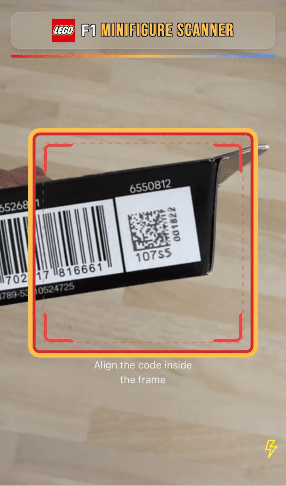
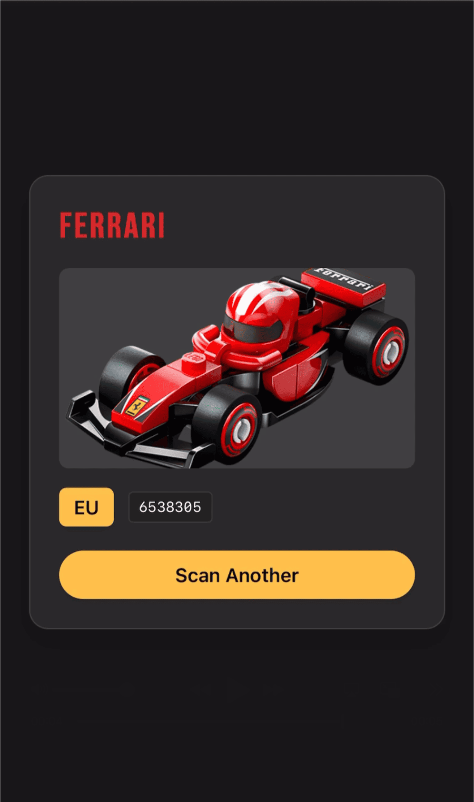

# Lego F1 Minifigure Scanner

  
   

> Disclaimer: This project is part of my exploration using AI tools (e.g., Cursor and Claude Code) within my development workflow. The code is largely AI‑generated. Use caution if you intend to reuse patterns or logic here.

## Background

Sunday morning hack: my nephews are collecting the Lego F1 minifigures and only have a few left to complete the set. At £3.50 per blind box, duplicates get expensive. I noticed the boxes have unique Data Matrix codes, and [this](https://www.reddit.com/r/lego/comments/1kbntn8/full_list_of_lego_71049_f1_collectibles_blind_box/) Reddit thread catalogs them.

So I built a quick 45‑minute web app using Cursor (GPT‑5 model) to scan the code and identify the minifigure/car inside.

## Preview

  
  

## Features

- Lego/F1 themed UI (Tailwind) with full‑screen scanner overlay
- Camera permissions flow + manual code entry fallback
- Data Matrix scanning (react-qr-scanner)
- Debounced scan handling + vibration + audio cue
- NA/EU dataset lookup (two codes for EU, one for NA)
- Result card with name, region badge, raw code, and image
- PWA: installable, offline precache, runtime caching for fonts
- GitHub Pages deployment via Actions

## Tech Stack

- React 18 + TypeScript, Vite
- Tailwind CSS (v4)
- `@yudiel/react-qr-scanner` for camera scanning
- `vite-plugin-pwa` for PWA

## Development

1. Install deps:
   - npm install
2. Run locally:
   - npm run dev
3. Build:
   - npm run build

## Deployment (GitHub Pages)

- A workflow at `.github/workflows/deploy.yml` builds on pushes to `main` and deploys `dist` to GitHub Pages.
- In repository Settings → Pages, select “GitHub Actions” as the source.

## Notes

- This app uses the first numeric token from the scanned string for matching (e.g., "6538305 107S5 ..." → "6538305").
- Public assets are served using `import.meta.env.BASE_URL` to work under Pages.
- React 18 is required for `@yudiel/react-qr-scanner` compatibility.
